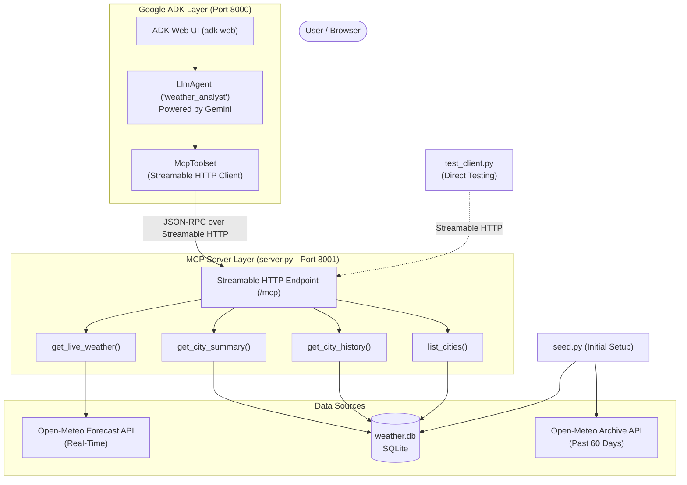

# Weather Analysis Agent (MCP + Google ADK)

An AI-driven weather analyst built on the **Model Context Protocol (MCP)** and **Google Agent Development Kit (ADK)**, powered by Google Gemini.

The system combines local historical weather analytics stored in SQLite with real-time global weather data fetched from the Open-Meteo API, exposing capabilities as standardized MCP tools over **Streamable HTTP**.

---

## 🌟 Key Features

- **Standardized MCP Architecture**: Weather tools are decoupled from the LLM, served over Streamable HTTP (`/mcp`) using the official Python MCP SDK (`mcp` 2.x `MCPServer`).
- **Dual Data Sources**:
  - **Historical Data**: 60-day archived weather metrics stored locally in SQLite (`weather.db`) for instant statistical aggregation.
  - **Live Conditions**: Real-time temperature, humidity, wind speed, and precipitation queried on demand via Open-Meteo Forecast API.
- **Agent Reasoning with Google ADK**: Gemini-powered `LlmAgent` automatically discovers MCP tools via `McpToolset`, plans multi-step lookups, and answers questions with grounded data.
- **Robust Error Handling**: Domain-level validation using `ToolError` prevents server crashes and provides human-readable explanations directly to the agent.
- **Dedicated Test Suite**: Standalone client script (`test_client.py`) for integration testing the MCP server without consuming LLM tokens.

---

## 🏗️ Architecture



---

## 📁 Repository Structure

```text
weather-agent-project/
├── agent/
│   └── agent.py         # Google ADK agent definition & Gemini instruction prompt
├── seed.py              # Database seeding script (creates tables & pulls 60 days of history)
├── server.py            # MCP server exposing weather tools on port 8001 (/mcp)
├── test_client.py       # Integration test script using the MCP Python Client SDK
├── weather.db           # SQLite database holding city records and historical weather
├── .env                 # Environment variables (Google API keys, server ports)
└── README.md            # Project documentation
```

---

## 🧰 MCP Tools Reference

The MCP server exposes four tools:

| Tool Name | Parameters | Description | Data Source |
| :--- | :--- | :--- | :--- |
| `list_cities` | None | Lists all supported cities with their country code and coordinates. | SQLite (`cities`) |
| `get_city_history` | `city: str`, `days: int = 14` | Day-by-day high/low temperatures and precipitation (1–60 days). | SQLite (`daily_weather`) |
| `get_city_summary` | `city: str`, `days: int = 30` | Statistical summary: average high/low, total rainfall, rainy-day count. | SQLite (`daily_weather`) |
| `get_live_weather` | `city: str` | Current temperature (°C), humidity (%), wind speed (km/h), and precipitation (mm). | Open-Meteo API |

---

## 🚀 Getting Started

### 1. Prerequisites

- Python 3.11+
- A Google AI Studio API key for Gemini

### 2. Environment Setup

Activate your virtual environment and configure your `.env` file:

```bash
source .venv/bin/activate
```

Create or verify `.env`:

```env
GOOGLE_API_KEY=your_google_gemini_api_key_here
GOOGLE_GENAI_USE_VERTEXAI=FALSE
WEATHER_MCP_PORT=8001
WEATHER_MCP_URL=http://127.0.0.1:8001/mcp
```

### 3. Seed the Database

Populate `weather.db` with historical weather data for sample cities (Hyderabad, Bengaluru, Mumbai, London, Tokyo, New York):

```bash
python seed.py
```

### 4. Start the Weather MCP Server

Launch the MCP tool server on port `8001`:

```bash
python server.py
```

### 5. Verify MCP Tools (Optional)

In another terminal, run the test client to verify all MCP endpoints and tools without using LLM tokens:

```bash
python test_client.py
```

### 6. Launch the Agent Chat Interface

Start the Google ADK web interface:

```bash
adk web
```

Open `http://localhost:8000` in your browser to chat with your Weather Analyst Agent!

---

## 💬 Example Queries for the Agent

- *"What is the current weather in London, and how does it compare to its temperatures over the last week?"*
- *"Summarize the rainfall and average temperatures for Hyderabad over the past 30 days."*
- *"Which city had more rainy days in the past month: Mumbai or Tokyo?"*
- *"What cities do you have data for?"*
